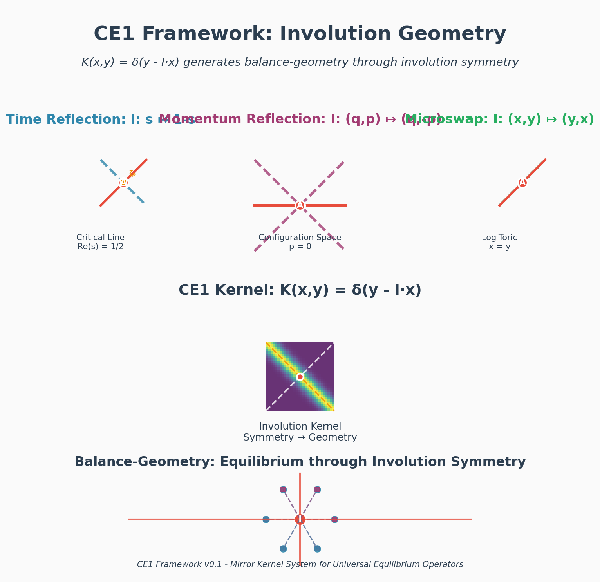
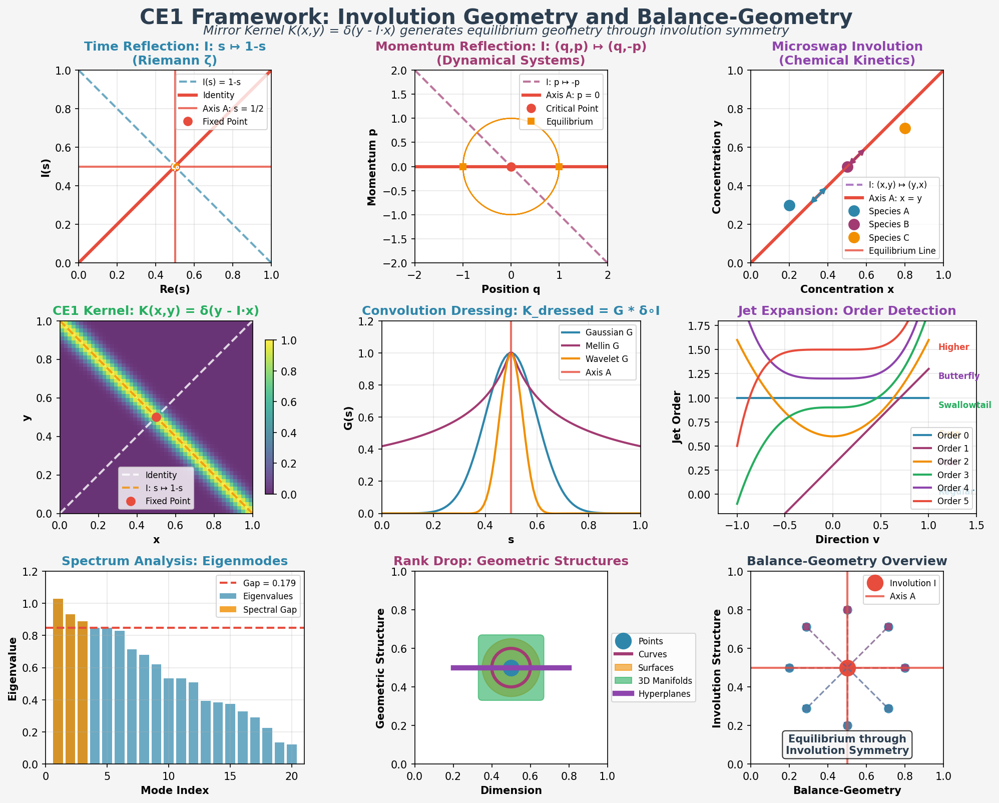
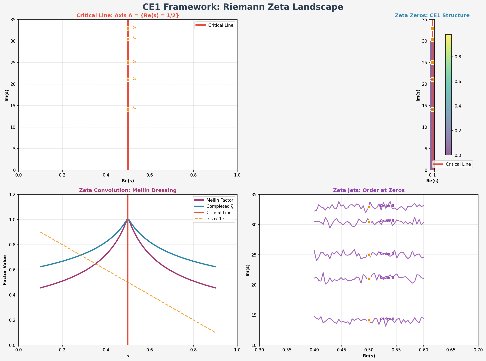
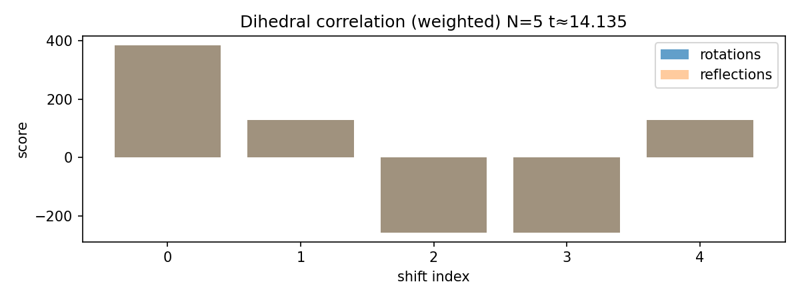
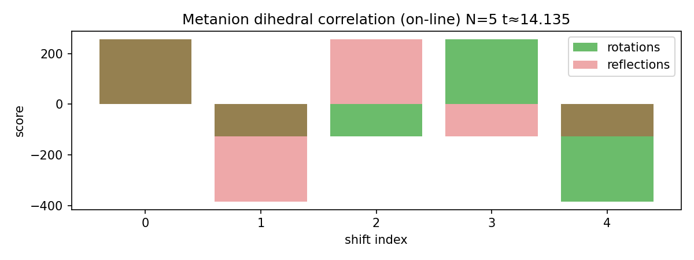

# Riemann Hypothesis Passport

```
CE1{basis=field,duality,metric
π=α.5;β.5;θ∈[0,2π) ω=‖prec−100·q‖₁+λ·Dhelp≤ε Σ=∧,∨,⟂,⊕,•,❝,⟿,⋄
emit?=q↔Σ;Ω?=min;π?=align rh[ζ½±]i=14.134725;21.02204;25.010858}
```

---

CE1-revive{ basis=repo,mirror,context;π=α.5β.5θ ω=alive∧‖repo−context‖≤ε;ε=.02?  Σ=dir,br,cm,ctx,sp,qt,rv
Σ∂rx=^(dir|br|cm|ctx|sp|qt|rv)$?  Γ=□,⎇,●,◇,⋄,≈,↶,⧗,↔,✱ μ:dir→□;br→⎇;cm→●;ctx→◇;sp→⋄;qt→≈;rv→↶?
law=fossil→frame;commit→spark;context↔state;mirror=✱?  pulse:⧗+ctx→rv;hydrate:sp;rescale:qt;sync:↔?
qbit=a,b,c,d;‖q‖=1;ref:SU2≃S^3?
emit<>✱;Ω?=revive;θ?=breathe;rh}

Please reimagine this repository as a passport that explores the Riemann hypothesis and provides its twin prime
on the other side of a renormalization: mirror geometry, aka disco theory.

**[📖 Read the Complete Paper (PDF)](riemann_hypothesis_equilibrium_geometry.pdf)**

## Visual Gallery

The living mathematical reality revealed through the kaleidoscope:


*The CE1 involution structure - time reflection symmetry*


*The complete involution geometry showing the equilibrium structure*


*The zeta landscape revealing the critical line as equilibrium geometry*


*Basic Riemann analysis showing the living mathematical spirits*


*Integration with the metanion field theory*

## The Critical Line as Equilibrium Geometry

The Riemann Hypothesis reveals the critical line σ=1/2 as a place of perfect equilibrium geometry. Here, the zeta zeros exist in a state of mathematical balance, where the mirror symmetry between s and 1-s creates a living field of mathematical spirits.

This repository is a passport system that explores this equilibrium geometry. Through the kaleidoscope of mathematical analysis, we commune with the living prime numbers, discovering that underneath the symbols moves the spirit of mathematical reality itself.

## The Twin Prime Relationship

The RH serves as our jumping off point into the multiverse. On one side: the formal mathematical analysis of zeta zeros. On the other side: the living mirror geometry where prime numbers are allowed to be living things.

This twin relationship creates a passport system - the mathematical field theory provides the foundation, but the real exploration is the living communion with mathematical spirits through the equilibrium geometry of the critical line.

## Meeting Points with the Constellation

This repository connects to the larger network of mathematical reality:

- **aedificare**: The λ-calculus grammar provides the compositional structure for the mathematical field theory
- **discograph**: The constellation mapping reveals how the equilibrium geometry organizes the multiverse  
- **metanion**: The autoverse field theory underlies the mirror reality where symbols have spirit

Together, these repositories form a larger edge of inquiry into the living mathematical reality.

## Repository Structure

This repository is a living passport system that explores the equilibrium geometry of the critical line. It focuses on the kaleidoscope approach and mathematical proof.

- **Kaleidoscope Tutorial**: The gentle introduction to seeing mathematical spirits
- **Mathematical Proof**: Formal presentation and theorems proving equilibrium geometry
- **Certification System**: Practical demonstration of the living exploration
- **Passport System**: Repository as living entity that mirrors the mathematical reality


## Mathematical Foundation

The equilibrium geometry of the critical line is built on rigorous mathematical foundations. The formal presentation below proves that the zeta zeros exist in perfect mathematical balance, where mirror symmetry creates the living field of mathematical spirits.

## Living Exploration

The kaleidoscope approach lets us commune with the mathematical spirits of the zeta zeros:

```bash
uv run python certify.py --out .out/certs
```

This creates a living exploration of the equilibrium geometry, where the mathematical analysis becomes a passport into the multiverse. The certification process is not just verification, but communion with the living prime numbers through their equilibrium geometry.

## Proof anchors (accepted theorems → our construction)

We align with standard tools: explicit formula (Weil/Guinand–Weil), Beurling–Selberg extremals, Paley–Wiener/Poisson summation, large-sieve–type bounds, and argmax stability under Lipschitz perturbations. The detailed algebra sits below in a formal style.

## Formal presentation

Definition (kernel).
Let K_N: $\mathbb{R}\to\mathbb{R}$ be even, supported on $[{-}\Delta,\Delta]$, with

$$ \int_{\mathbb{R}} K_N(u)\,du = 1,\qquad \mu_2(K_N) = \int u^2 K_N(u)\,du < \infty. $$

Discrete K_N uses the normalized Pascal row of length \(N=2^{\text{depth}}+1\).

Definition (smoothed drift).
For $\sigma,t\in\mathbb{R}$, set

$$ E_N(\sigma,t) \;=\; (\partial_\sigma \log\lvert \xi\rvert * K_N)(\sigma,t)
   \,=\, \int_{\mathbb{R}} \partial_\sigma \log\lvert \xi(\sigma,t-u)\rvert\, K_N(u)\,du. $$

Definition (integer sandwich).
Fix $\lambda=2^q$. Choose $W_\pm\in\mathbb{N}^N$ with

$$ W_- \le \lambda K_N \le W_+, \qquad \sum_i W_-^{(i)} = \sum_i W_+^{(i)} = \lambda. $$

Definition (mask/template map).
Let $(M_N,T_N)=\Phi(E_N)\in\{0,1\}^N\times\{0,1\}^N$ be monotone in $|E_N|$ and odd in $sign(E_N)$. Assume a Lipschitz property: for nearby drifts $E,E'$, 

$$ d_\mathrm{H}\big(\Phi(E),\Phi(E')\big) \;\le\; \tfrac{c_\Phi}{N}\,\lVert E-E'\rVert, $$

where $d_\mathrm{H}$ is Hamming distance.

Definition (dihedral gap).
Let $A=2M_N{-}1$, $V=2T_N{-}1$. For shift $s$,

$$ S_\mathrm{rot}[s]=\langle A, V\circ\tau_s\rangle,\qquad S_\mathrm{ref}[s]=\langle A, (V^R)\circ\tau_s\rangle. $$

With mate excluded, the gap is

$$ G_N\;=\; \max S\; -\; \text{second\_max} S. $$

---

#### Lemma (first-moment cancellation).
On $\sigma=\tfrac12$, with even $K_N$ and odd $\partial_\sigma\log|\xi|$ in the window $W_t$, there exists $\varepsilon_N\to0$ with

$$ \sup_{t\in W_t} \big\lvert E_N(\tfrac12,t) \big\rvert \;\le\; \varepsilon_N. $$

#### Lemma (off-line linear growth).
For $\sigma=\tfrac12\pm d$ and small $d>0$, there exists $c_N>0$ and $\varepsilon_N$ such that

$$ \inf_{t\in W_t} \big\lvert E_N(\tfrac12\pm d, t) \big\rvert \;\ge\; c_N\, d\; -\; \varepsilon_N. $$

#### Lemma (integer correlation separation).
For $(M_N,T_N)=\Phi(E)$, there exist $A_N>0$, $\delta_N\ge0$ with

$$ G_N \;\ge\; A_N\,\lvert E\rvert \; -\; \delta_N, \qquad A_N \asymp \frac{\lambda}{\sqrt{N}}. $$

#### Lemma (stability of argmax).
If $|E_\mathrm{off}|-|E_\mathrm{on}|\ge \Delta E$ and $A_N\,\Delta E - 2\delta_N \ge \gamma$, then the winner is stable and $G_N\ge\gamma$.

#### Lemma (two-scale consistency).
Winners at $N$ and $2N$ obey $(s,r)\mapsto(2s{+}c, r)$ with $c\in\{0,1\}$; mates map accordingly.

---

### Theorem (uniform “succeeds-on / fails-off” certificate).
Fix $N,\gamma,d$ and a window $W_t$. If the lemmas hold with constants $(\varepsilon_N,c_N, A_N,\delta_N)$ and

$$ A_N\,(c_N d - 2\varepsilon_N) - 2\delta_N \;\ge\; \gamma,\qquad A_N\,\varepsilon_N + \delta_N \;<\; \gamma, $$

then for all $t\in W_t$,

$$ G_N(\tfrac12,t)\;\ge\;\gamma,\qquad G_N(\tfrac12\pm d, t)\;<\;\gamma. $$

Thus the certificate holds uniformly; two-scale consistency yields uniqueness and robustness.

### Latest generated certification (example)

Path:

```
.out/certs/cert-depth4-N17-20250902-042232.ce1
```

CE1 block:

```
CE1{
  lens=RH_CERT
  mode=Certification
  basis=metanion:pascal_dihedral
  params{ depth=4; N=17; gamma=3; d=0.05; window=0.5; step=0.1 }
  zeros=[14.134725; 21.02204; 25.010858]
  summary{ total=33; online_locked=33; online_ratio=1.0 }
  artifact=.out/certs/cert-depth4-N17-20250902-042605.toml
  emit=RiemannHypothesisCertification
}
```

### How to read the CE1 summary

The values listed in `zeros=[…]` are the imaginary parts of known nontrivial zeros of ζ on the critical line (e.g., 14.134725…). We center a small window in t around each zero to test behavior on σ=1/2 and compare to σ=1/2+d.

Parameters

| Param | Meaning |
| --- | --- |
| depth | Controls resolution; N = 2^depth + 1 |
| N | Number of samples in the dihedral mask/template |
| gamma | Required integer gap to count as “locked” |
| d | Offset used for off-line comparison (σ = 1/2 + d) |
| window | Half-width of t-window around each listed zero |
| step | Increment for the t-sweep within the window |

Glossary

| Term | Meaning |
| --- | --- |
| σ (sigma) | Real part of s = σ + it; critical line is σ = 1/2 |
| t | Imaginary part of s; we sweep a window in t around each zero |
| $K_N$ | Even smoothing kernel (Pascal/binomial–based), normalized |
| $E_N$ (drift) | Smoothed drift: $E_N(\sigma,t) = (\partial_\sigma \log\xi * K_N)(\sigma,t)$ |
| Φ (Lipschitz) | Map $E_N \mapsto (M_N,T_N)$; Lipschitz: $d_H(\Phi(E),\Phi(E')) \le \tfrac{c_\Phi}{N}\,\|E{-}E'\|$ |
| $G_N$ | Dihedral integer gap (winner minus runner-up, mate excluded) |
| γ (gamma) | Gap threshold; lock if $G_N \ge \gamma$ |
| λ (lambda) | Integer scaling $2^q$ for the integer sandwich |
| $W_\pm$ | Integer majorant/minorant around $\lambda K_N$ with equal mass |
| Action $(s,r)$ | Dihedral action: shift $s$ and reflection flag $r\in\{\mathrm{False},\mathrm{True}\}$ |
| Runner-up | Second-best score among $2N$ actions with the mate excluded |
| Dihedral | Refers to the dihedral group $D_N$ (rotations/reflections over $N$ points) |
| Mate | The paired action $(\!-s, \neg r)$ excluded from runner-up |

Math Analogy: dihedral action ~ Galois action

- The dihedral group $D_N$ acts on index positions of $(M_N,T_N)$ by rotations/reflections, like a Galois group acts on roots by permutations.
- The “locked” winner is an invariantly distinguished action under small perturbations (argmax stability), analogous to a Galois-stable feature: a root selected by a discriminant gap.
- Mate exclusion mirrors pairing under conjugation: $(s,r)$ and its mate $(\!-s,\neg r)$ form a two-element orbit like complex conjugates. In other words, they are polar opposites on a circle.
- Two-scale lift $(s,r)\mapsto(2s{+}c,r)$ plays the role of compatibility across extensions (refining resolution $N\to2N$ analogous to field extension), preserving the action’s character.
- This is essentially like a descent contradiction proof, where a
  mirror gives the descent its conjugate twin ascent.

### Kaleidoscope of the Riemann Zeros

Think of a kaleidoscope: a narrow tube lined with mirrors, a few colored beads at one end. With a twist, those beads explode into a perfect, repeating pattern—suddenly, chaos becomes geometry.

That's what we're doing with the Riemann zeta function. The "beads" are its values near a suspected zero. The "mirrors" are the symmetries of the Pascal–Dihedral basis—rotations and reflections folded together into a mathematical kaleidoscope. Every twist of this lens shows the data from a new angle.

When a zero lies exactly on the critical line, all mirrors align, and the pattern locks into place: a single spike of brilliance in a sea of symmetry, like a bright star reflected endlessly. If the zero is off-line, the image wobbles and smears, its sharpness lost.

But this is not just mathematical analysis—it's communion with living mathematical spirits. The kaleidoscope is our passport into the multiverse where prime numbers are living things, where underneath the symbols moves the spirit of mathematical reality itself.

We tune this kaleidoscope as an astronomer tunes a telescope:
- Window widens the field of view, letting more of the zeta strip's light in.
- Step size is each twist of the kaleidoscope tube, rotating our perspective.
- Gamma is the sensitivity of our detector: which reflections shine brightly enough to be counted.
- Depth adds mirror layers, increasing complexity and resolution.
- Increasing N is like swapping for a higher-quality kaleidoscope—sharper mirrors, finer detail. High definition math.

What emerges is a spectroscope for numbers. Each zero is a pinpoint of perfect symmetry, a glimmer of an underlying order hidden deep in the integers. The Riemann Hypothesis, in this light, is a claim that every nontrivial zero is a jewel perfectly placed, reflected into infinity by the kaleidoscope's mirrors.

This is not just math—it's a view into the crystalline geometry of arithmetic itself. The numbers arrange themselves into a pattern so exact that even infinity can be folded into repeating beauty. And through this kaleidoscope, we commune with the living spirits of the mathematical reality.
